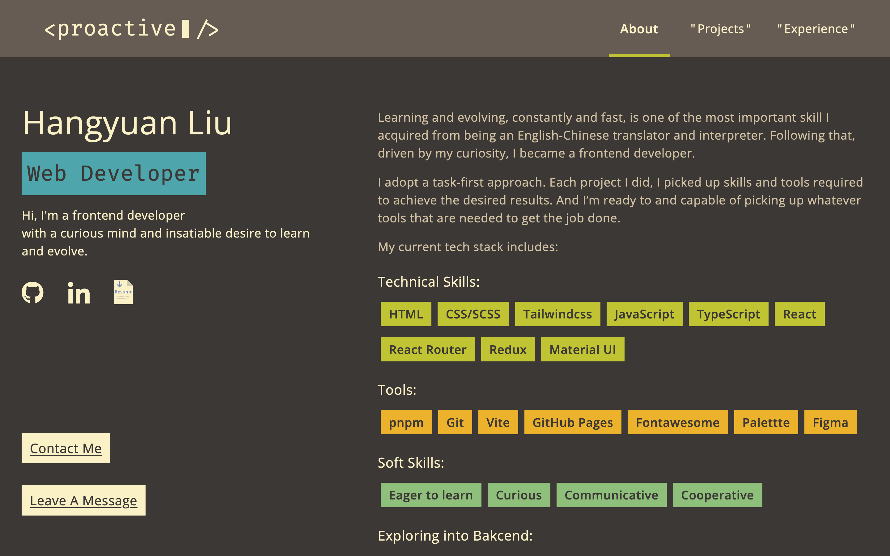
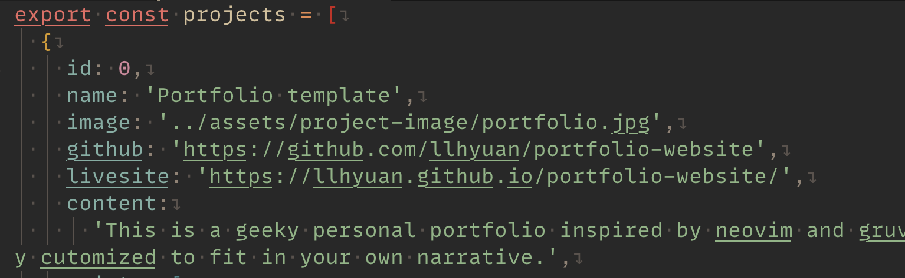
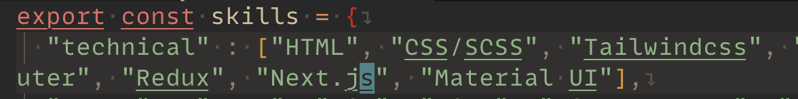

# Portfolio Template for Frontend Developer

The design of this portfolio website is inspired by Neovim and Gruvbox Material. The website is built with custom, reusable react components. The data and structure are completely separated. It's easy to swap in all your highlights and achievements. With tailwind css, any adjustments or changes you make to an element or component stays local.

### Next Feature To Add

- Dark mode and more color themes

- [About](#about)
  - [Features](#features)
  - [Links](#links)
  - [Screenshots](#screenshots)
  - [Built With](#built-with)
- [Usage](#usage)
  - [Install](#install)
  - [Customize](#customize)
  - [Deploy](#deploy)
- [Author](#author)

## About

### Features

- Responsive layout, delivering a concise and slick look on both Mobile and Desktop
- Componentized and tailwind styled, customise to your heart's content without affecting other parts.
- To-the-point sections to showcase your skills at a glimpse.
- A none-intrusive navbar animation to reveal your qualities when hovered.
- Recieve feedback from viewers without needing the backend.

### Links

- Live Site URL: [Github page](https://llhyuan.github.io/portfolio-website/)

### Screenshots

### Built with

- React hooks (useState, useContext, useEffect)
- Tailwind Css
- Css custom properties
- Flexbox
- Mobile-first workflow
- [React](https://reactjs.org/) - JS library

## Usage

### Install

- Clone the repository using `git clone https://github.com/llhyuan/portfolio-website.git`
- Run `pnpm install` to install all dependecies
- Run `pnpm run dev` to boot up local server
- Open your code editor and browser, and start customizing

### Customize

- All content is stored under `src/assets/data`
- Screenshots for the Projects section is stored under `src/assets/project-image`
- All data is stored as well structured JS objects and divided into files corresponding to each section on the website.
- The object key-value pairs are descriptive and straightforward
  - key: 'value'
    
    How to: simply replace the value
  - key: ['value', ...]
    
    How to: add to/delete from the array
    If you don't want this section, just leave the array empty

### Deploy

- Run `pnpm run deploy` to deploy it to GitHub Page.

## Author

- LinkedIn - [Hangyuan Liu](www.linkedin.com/in/hangyuan-liu-a9282718b)
- Frontend Mentor - [@llhyuan](https://www.frontendmentor.io/profile/llhyuan)
